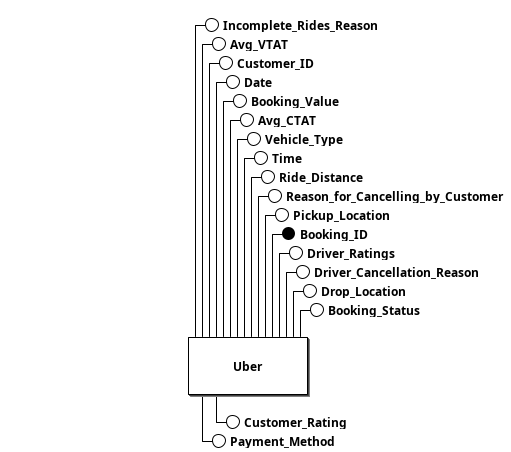
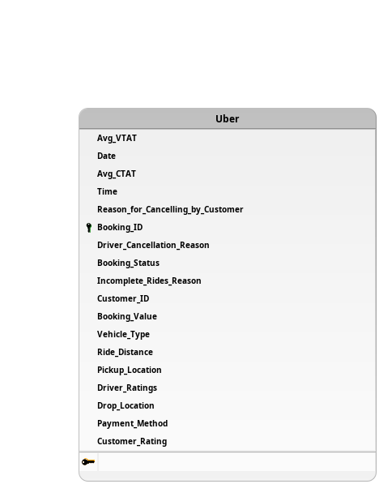

# Documentação de Modelagem de Dados – Projeto Uber Ride Analytics

## Contextualização

Este documento apresenta a modelagem de dados desenvolvida para o projeto Uber Ride Analytics, cujo objetivo é criar uma estrutura analítica em camadas (Bronze, Silver e Gold) para extração e tratamento de dados provenientes do dataset público do Kaggle: Uber Ride Analytics Dashboard.

A modelagem tem como finalidade representar, de forma conceitual e lógica, as principais entidades, relacionamentos e atributos necessários para compor o banco de dados MySQL containerizado que servirá como base para o processo ETL (Raw → Silver → Gold).

## 1. MER

1. Entidade

* Uber

2. Atributos

    Uber(__Booking_ID__ ,Date , Time, Booking_Status, Customer_ID, Vehicle_Type, Pickup_Location, Drop_Location,Avg_VTAT, Avg_CTAT, Reason_for_cancelling_by_Customer, Driver_Cancellation_Reason, Incomplete_Rides_Reason, Booking_Value, Ride_Distance ,Driver_Ratings ,Customer_Rating , Payment_Method)


## 2. DLD

O Diagrama Lógico de Dados (DLD) representa o modelo físico preliminar da base de dados, com os campos e chaves primárias definidos. A figura abaixo mostra a tabela principal Uber, com todos os atributos que compõem o conjunto de dados extraído e tratado.



### Descrição:

- A tabela Uber contém 19 atributos principais.
- O campo Booking_ID é a chave primária (PK).
- Todos os demais campos estão relacionados a informações complementares sobre a corrida, como:
  - Dados do cliente e motorista (Customer_ID, Driver_Ratings, Customer_Rating)
  - Dados de tempo e distância (Date, Time, Ride_Distance, Avg_CTAT, Avg_VTAT)
  - Localização (Pickup_Location, Drop_Location)
  - Status e cancelamentos (Booking_Status, Reason_for_Cancelling_by_Customer, Driver_Cancellation_Reason, Incomplete_Rides_Reason)
  - Informações financeiras (Booking_Value, Payment_Method)
  - Características do veículo (Vehicle_Type)

## 3. DER



### Descrição:

- A entidade Uber representa o registro principal de uma corrida.
- Cada corrida é identificada de forma única pelo atributo Booking_ID.
- A estrutura agrupa informações sobre o cliente, motorista, localização, tipo de veículo, avaliações, cancelamentos e métricas de tempo.
- Essa representação hierárquica facilita o entendimento do relacionamento entre atributos e o fluxo de dados ao longo do processo analítico.

## Dicionário de Dados

O dicionário de dados a seguir contém informações sobre cada um dos atributos, sua descrição, tipo de dados que será implementado no banco, e sua restrição de domínio.

| Nome                                | Descrição                                                                 | Tipo               | Restrições de Domínio |
|-------------------------------------|---------------------------------------------------------------------------|--------------------|-----------------------|
| Date                                | Data da solicitação da corrida.                                          | DATE                | NOT NULL              |
| Time                                | Horário da solicitação da corrida.                                       | TIME                | NOT NULL              |
| Booking_ID                          | Identificador único da reserva.                                          | VARCHAR(20)         | PK                    |
| Booking_Status                      | Status da reserva                                                        | VARCHAR(30)         | NOT NULL              |
| Customer_ID                         | Identificador único do cliente.                                          | VARCHAR(20)         | NOT NULL              |
| Vehicle_Type                        | Tipo de veículo solicitado                                               | VARCHAR(30)         | NOT NULL              |
| Pickup_Location                     | Local de origem da corrida.                                              | VARCHAR(100)        | NOT NULL              |
| Drop_Location                       | Local de destino da corrida.                                             | VARCHAR(100)        | NOT NULL              |
| Avg_VTAT                            | Tempo médio para atribuir um veículo.                                    | NUMERIC(5,2)        |                       |
| Avg_CTAT                            | Tempo médio para atribuir um cliente.                                    | NUMERIC(5,2)        |                       |
| Reason_for_cancelling_by_Customer   | Motivo do cancelamento por parte do cliente                              | TEXT                |                       |
| Driver_Cancellation_Reason          | Motivo do cancelamento por parte do motorista.                           | TEXT                |                       |
| Incomplete_Rides_Reason             | Motivo pelo qual a corrida foi marcada como incompleta.                  | TEXT                |                       |
| Booking_Value                       | Valor monetário da corrida                                               | NUMERIC(7,2)        |                       |
| Ride_Distance                       | Distância percorrida na corrida                                          | NUMERIC(6,2)        |                       |
| Driver_Ratings                      | Avaliação média dada ao motorista                                        | NUMERIC(3,2)        |                       |
| Customer_Rating                     | Avaliação média dada pelo motorista ao cliente.                          | NUMERIC(3,2)        |                       |
| Payment_Method                      | Forma de pagamento utilizada                                             | VARCHAR(20)         |                       |


## Data Definition Language (DDL)

O comando SQL abaixo cria o banco de dados Uber, baseando-se no MER, DER e dicionário de dados
```sql
CREATE TABLE IF NOT EXISTS Uber (
    Booking_ID VARCHAR(20) PRIMARY KEY,
    Date DATE NOT NULL,
    Time TIME NOT NULL,
    Booking_Status VARCHAR(30) NOT NULL,
    Customer_ID VARCHAR(20) NOT NULL,
    Vehicle_Type VARCHAR(30) NOT NULL,
    Pickup_Location VARCHAR(100) NOT NULL,
    Drop_Location VARCHAR(100) NOT NULL,
    Avg_VTAT NUMERIC(5,2),
    Avg_CTAT NUMERIC(5,2),
    Reason_for_cancelling_by_Customer TEXT,
    Driver_Cancellation_Reason TEXT,
    Incomplete_Rides_Reason TEXT,
    Booking_Value NUMERIC(7,2),
    Ride_Distance NUMERIC(6,2),
    Driver_Ratings NUMERIC(3,2),
    Customer_Rating NUMERIC(3,2),
    Payment_Method VARCHAR(20)
);
```

